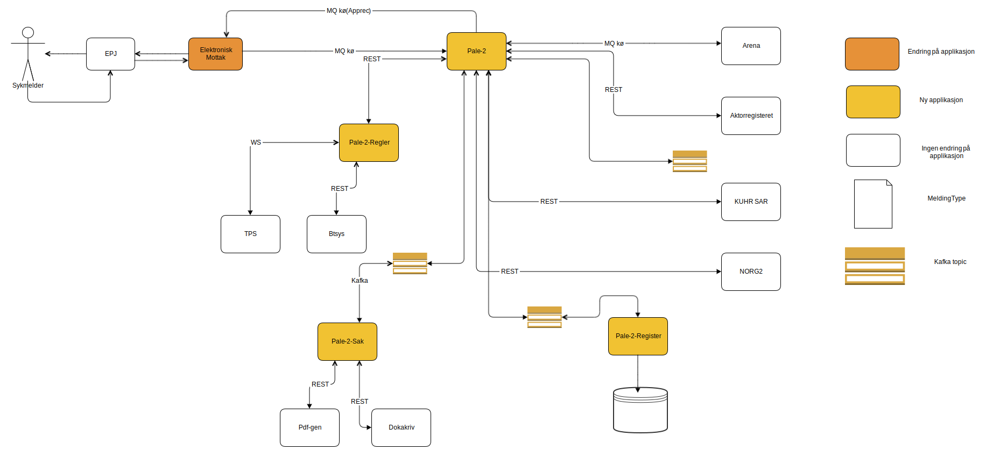

[](https://github.com/navikt/pale-2-register/workflows/Deploy%20to%20dev%20and%20prod/badge.svg)

# Persisting of legeerklæringer
Application for persisting legeerklæringer in database




## Technologies used
* Kotlin
* Ktor
* Gradle
* JDK 12
* Junit
* Jackson
* Postgres

#### Requirements

* JDK 12

### Getting github-package-registry packages NAV-IT
Some packages used in this repo is uploaded to the Github Package Registry which requires authentication. It can, for example, be solved like this in Gradle:
```
val githubUser: String by project
val githubPassword: String by project
repositories {
    maven {
        credentials {
            username = githubUser
            password = githubPassword
        }
        setUrl("https://maven.pkg.github.com/navikt/pale-2-common)
    }
}
```

`githubUser` and `githubPassword` can be put into a separate file `~/.gradle/gradle.properties` with the following content:

```                                                     
githubUser=x-access-token
githubPassword=[token]
```

Replace `[token]` with a personal access token with scope `read:packages`.

Alternatively, the variables can be configured via environment variables:

* `ORG_GRADLE_PROJECT_githubUser`
* `ORG_GRADLE_PROJECT_githubPassword`

or the command line:

```
./gradlew -PgithubUser=x-access-token -PgithubPassword=[token]
```

### Build and run tests
To build locally and run the integration tests you can simply run `./gradlew shadowJar` or on windows 
`gradlew.bat shadowJar`

### Creating a docker image
Creating a docker image should be as simple as `docker build -t pale-2-register .`

### Running a docker image
`docker run --rm -it -p 8080:8080 pale-2-register`

## Running in development mode
To run pale-2-register locally you need a bunch of other services like Vault, a PostgreSQL database, an authentication service, Kafka, Zookeeper etc. 

### docker-compose
Docker-compose enviroment setup for running local development

Setup for kafka (zookeeper, kafkadminrest, schema-registry, openldap) is borrowed from [navkafka-docker-compose](https://github.com/navikt/navkafka-docker-compose)

### Start the enviroment 

Run this command first
```docker login -u [BRUKERNAVN] -p [TOKEN] docker.pkg.github.com```
Change the [BRUKERNAVN] with your github username, and change [TOKEN], with a personal a access token from github
 that has the scope `read:packages`.
 
```docker-compose -f docker-compose.yml up```

### Add the kafka topics
```curl --user igroup:itest -X POST "http://localhost:8840/api/v1/topics" -H "accept: application/json" -H "content-type: application/json" -d "{ \"name\": \"privat-syfo-pale2-ok-v1\", \"numPartitions\": 1}" curl --user igroup:itest -X POST "http://localhost:8840/api/v1/topics" -H "accept: application/json" -H "content-type: application/json" -d "{ \"name\": \"privat-syfo-pale2-avvist-v1\", \"numPartitions\": 1}"```

### Runing the app
1. Create a local run config for pale-2-register pointing to Bootstrap.tk (For run config in intellij see: https://www.jetbrains.com/help/idea/creating-and-editing-run-debug-configurations.html)
2. Add the contents of dev-stack/dev-runtime-env as runtime environments in the run config.
3. enjoy develolping localy

## One liner to stop / remove all of Docker containers

```
docker stop $(docker ps -a -q)
docker rm $(docker ps -a -q)
```


### Access to the Postgres database

For utfyllende dokumentasjon se [Postgres i NAV](https://github.com/navikt/utvikling/blob/master/PostgreSQL.md)

#### Tldr

The application uses dynamically generated user / passwords for the database.
To connect to the database one must generate user / password (which lasts for one hour)
as follows:

Use The Vault Browser CLI that is build in https://vault.adeo.no


Preprod credentials:

```
read postgresql/preprod-fss/creds/pale-2-register-admin

```

Prod credentials:

```
read postgresql/prod-fss/creds/pale-2-register-readonly

```


## Contact us
### Code/project related questions can be sent to
* Joakim Kartveit, `joakim.kartveit@nav.no`
* Andreas Nilsen, `andreas.nilsen@nav.no`
* Sebastian Knudsen, `sebastian.knudsen@nav.no`
* Tia Firing, `tia.firing@nav.no`
* Jonas Henie, `jonas.henie@nav.no`
* Mathias Hellevang, `mathias.hellevang@nav.no`

### For NAV employees
We are available at the Slack channel #team-sykmelding