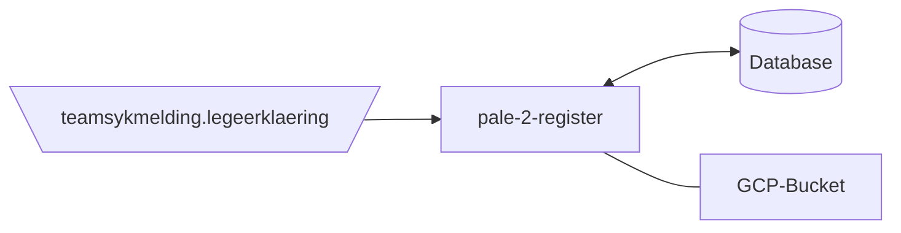

[](https://github.com/navikt/pale-2-register/workflows/Deploy%20to%20dev%20and%20prod/badge.svg)

# Persisting of legeerklæringer
Application for persisting legeerklæringer in database

## FlowChart
This the high level flow for the application


## Technologies used
* Kotlin
* Ktor
* Gradle
* Junit
* Jackson
* Postgres

#### Requirements
* JDK 21

Make sure you have the Java JDK 21 installed locally
You can check which version you have installed using this command:
``` bash
java -version
```

### Build and run tests
To build locally and run the integration tests you can simply run `./gradlew shadowJar` or on windows 
`gradlew.bat shadowJar`

### Creating a docker image
Creating a docker image should be as simple as `docker build -t pale-2-register .`

### Running a docker image
`docker run --rm -it -p 8080:8080 pale-2-register`

### Access to the Postgres database

For information on connecting to dev og prod DB see: [Postgres GCP](https://doc.nais.io/cli/commands/postgres/)

### Upgrading the gradle wrapper
Find the newest version of gradle here: https://gradle.org/releases/ Then run this command:

```./gradlew wrapper --gradle-version $gradleVersjon```

### Contact

This project is maintained by [navikt/teamsykmelding](CODEOWNERS)

Questions and/or feature requests? Please create an [issue](https://github.com/navikt/pale-2-register/issues)

If you work in [@navikt](https://github.com/navikt) you can reach us at the Slack
channel [#team-sykmelding](https://nav-it.slack.com/archives/CMA3XV997)
